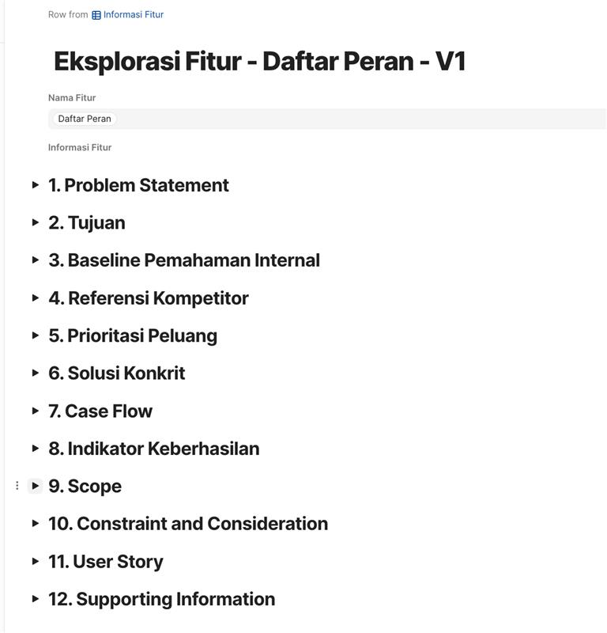

# Update Kendala PO

## 12.26.2025 - Shania



#### Variasi Perangkat ga muncul

<figure><figcaption></figcaption></figure>

<figure><figcaption></figcaption></figure>

Fixed ✅ :

<figure><figcaption></figcaption></figure>



#### Validasi Sistem ga muncul

<figure><figcaption></figcaption></figure>

Fixed ✅ :&#x20;

<figure><figcaption></figcaption></figure>



#### Apakah bisa setiap Section ini baik di header atau di table of contentnya dinomori

<figure><figcaption></figcaption></figure>

Fixed ✅ :&#x20;

<figure><figcaption></figcaption></figure>



## 2.18.2026 - Dimas



#### Kebutuhan melampirkan file selain foto

1. **Expected**\
   saat po melakukan analisis kompetitor, kadang kita perlu buat mendokumentasikan observasi kita dengan video/screen capture. kalo di coda biasanya dalam sebuah table/grid bisa di sematkan video.
2. **Current Condition**\
   untuk di JK sekarang saya masih belum nemu cara untuk upload video lampiran, sudah coba menggunakan "/media" namun tidak bisa menerima inputan selain jpg/png/jpeg. \
   >)
3. **Expected**\
   Media untuk diupload ini harapannya bisa berbagai macam type mulai video s/d pdf



#### Kebutuhan penomoran per section

1. **Current Condition**\
   kalo dilihat pada dokumen hasil dari eksplorasi fitur, pada table of contentnya sudah ada nomor per sectionnya. Namun, untuk dokumen yang dibaca masih belum ada. Ini membuat pembaca agak kesulitan untuk mengetahui mereka sudah ada di section berapa.\
   
2. **Expected**\
   Ada angka/penomoran per sectionnya. seperti yang sudah PO lakukan secara manual di Coda
3.


